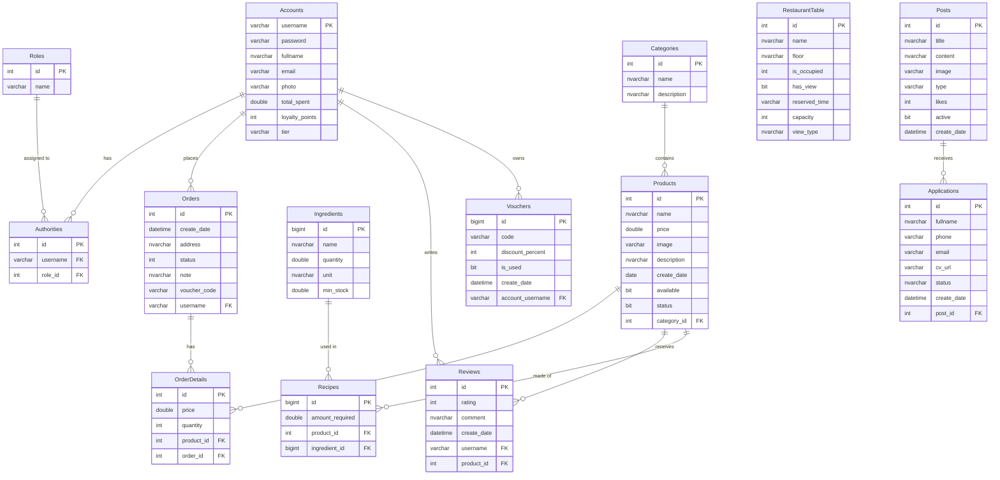

# Sơ đồ Cơ Sở Dữ Liệu (ERD) - FPOLY RESTAURANT

Dưới đây là sơ đồ thực thể mối quan hệ (ERD) mô phỏng cấu trúc database của hệ thống quản lý nhà hàng FPOLY, dựa trên các Entity của backend Spring Boot.

## Các Bảng Chính
- **Hệ thống Tài khoản & Quyền**: `Accounts`, `Roles`, `Authorities`.
- **Thực đơn & Kho**: `Categories`, `Products`, `Ingredients`, `Recipes`.
- **Giao dịch & Đơn hàng**: `Orders`, `OrderDetails`.
- **Tương tác Khách hàng**: `Reviews`, `Vouchers`.
- **Marketing & Tuyển dụng**: `Posts`, `Applications`.
- **Vận hành Tiền sảnh**: `RestaurantTable`.
